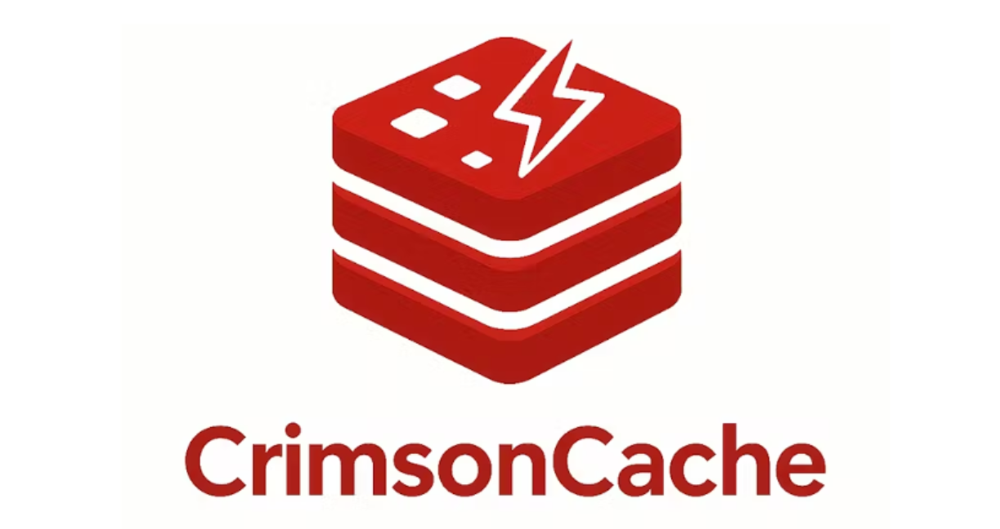

<p align="center">
  
    <p align="center">
        CrimsonCache is a custom in-memory data store inspired by Redis, offering essential caching commands, data persistence, and replication. It's built as a robust learning tool for exploring networking, concurrency, and distributed systems.
    </p>
</p>


## Features

-   **Core Functionality**

    -   In-memory key-value storage with efficient hash table implementation
    -   Support for string data type (with more planned)
    -   Key expiration mechanism with TTL
    -   LRU cache eviction for memory management

-   **Networking**

    -   TCP server with IPv4/IPv6 dual-stack support
    -   RESP (Redis Serialization Protocol) compatible responses
    -   Support for 50+ concurrent client connections via multi-threading
    -   Clean connection handling and error management

-   **Persistence**

    -   RDB-style snapshot persistence for point-in-time recovery
    -   Background saving with fork() for non-blocking operation
    -   Automatic periodic saving based on changes and time
    -   Atomic file operations for crash-safe persistence

-   **Planned Features**
    -   Primary-replica replication
    -   Additional data types (lists, sets)
    -   Transaction support (MULTI/EXEC)
    -   Pub/Sub messaging system
    -   Basic authentication

## Getting Started

### Prerequisites

-   GCC/Clang compiler
-   Make build system
-   POSIX-compliant OS (Linux, macOS, etc.)

### Installation

```bash
git clone https://github.com/varunrmantri23/CrimsonCache.git
cd CrimsonCache
make
```

## Usage

To compile the project, navigate to the project root and run `make`:
```bash
make
```

To run the server:

**Using default configuration:**
```bash
./bin/crimsoncache
```
This will start the server using the default settings. If `crimsoncache.conf` is not found in the current directory, default settings will be applied, and a warning message will be displayed.

**Using a custom configuration file:**
```bash
./bin/crimsoncache /path/to/your/custom.conf
```

## Configuration

CrimsonCache can be configured via the `crimsoncache.conf` file in the project root. This file allows you to customize various server settings.

### Available Configuration Options:

*   `port <number>`: Sets the port the server listens on (default: `6379`).
*   `concurrency <model>`: Sets the concurrency model. Options:
    *   `threaded` (default): Uses a new thread for each client connection. Simple, but less scalable for many concurrent clients.
    *   `eventloop`: Uses a single-threaded event loop with `epoll` (Linux-specific) for high-performance I/O multiplexing. Recommended for production-like environments.
*   `maxClients <number>`: Sets the maximum number of concurrent clients the server can handle (default: `100`).
*   `logFile <path>`: Sets the path for the server's log file (default: `crimsoncache.log`).
*   `saveSeconds <number>`: Sets the time in seconds after which the database is automatically saved if changes occurred (default: `300`).
*   `saveChanges <number>`: Sets the number of changes after which the database is automatically saved (default: `1000`).
*   `bufferSize <number>`: Sets the size of the client input buffer in bytes (default: `1024`).
*   `maxEvents <number>`: Sets the maximum number of events to be processed by the event loop at once (default: `64`).

## Connect to Running Server

### Method 1: Using Netcat (nc)

Open a new terminal window and use netcat to connect to your server:

```bash
nc localhost 6379
```

Once connected, type PING and press Enter. You should see:

```bash
PING
+PONG
```

### Method 2: Using Telnet

```bash
telnet localhost 6379
```

Once connected, type PING and press Enter. You should see:

```bash
PING
+PONG
```

### Method 3: Using Redis CLI (if installed)

If you happen to have the Redis command line interface installed:

```bash
redis-cli -p 6379 ping
```

This should return PONG.

## Supported Commands

CrimsonCache currently supports the following commands:

### Basic Commands

-   `PING [message]` - Test connectivity, returns PONG or the message if provided
-   `SET key value [EX seconds]` - Set a key to a value with optional expiration
-   `GET key` - Get the value of a key
-   `DEL key [key ...]` - Delete one or more keys
-   `EXISTS key [key ...]` - Check if keys exist
-   `EXPIRE key seconds` - Set a key's time to live in seconds
-   `TTL key` - Get the time to live for a key

### Persistence Operations

-   `SAVE` - Synchronously save the dataset to disk
-   `BGSAVE` - Asynchronously save the dataset to disk in the background

## Data Persistence

CrimsonCache provides RDB-style persistence similar to Redis:

-   **Automatic Saving**: The database is automatically saved to disk:

    -   After a specified number of changes (default: 1000)
    -   After a specified time period (default: 300 seconds/5 minutes)

-   **Manual Saving**: You can trigger persistence manually:

    -   `SAVE` command performs a blocking save operation
    -   `BGSAVE` command saves in the background without blocking

-   **Recovery**: When the server starts, it automatically loads the latest snapshot from disk.

## Testing Your Redis-compatible Commands

Since CrimsonCache implements Redis protocol, you can use any Redis client to interact with it:

```bash
# Using redis-cli
redis-cli -p 6379 set mykey "Hello World"
redis-cli -p 6379 get mykey

# Using netcat
nc localhost 6379
SET mykey "Hello World"
GET mykey
```

## Implementation Details

-   **Configurable Concurrency:** Supports both a multi-threaded (thread-per-client) and a high-performance single-threaded event-loop (using `epoll`) architecture.
-   Dual-stack IPv4/IPv6 networking implementation
-   LRU cache eviction algorithm for memory management
-   Fork-based background saving for non-blocking persistence
-   Properly handles quoted strings in commands

### Transitioning to the Event Loop Model

The Problem with Threaded Concurrency: While easy to implement, the thread-per-client model (where each client connection gets its own dedicated thread) does not scale efficiently for a high number of concurrent connections. Each thread consumes significant memory and CPU resources, leading to excessive context switching overhead as the number of clients grows. This limits the server's ability to handle many clients simultaneously without performance degradation.

The Solution: Event Loop with epoll: To overcome these limitations, CrimsonCache was refactored to support an event loop concurrency model, leveraging epoll on Linux. This approach allows a single thread to manage thousands of concurrent connections efficiently by using non-blocking I/O.

Instead of removing the threaded logic, I have added option to manually set config


## Contribution

Contributions are welcome and greatly appreciated! This project was built as a learning tool, and any improvements that can help others learn are fantastic.

If you find any bugs, have a feature request, or want to contribute code, please feel free to:

1.  **Open an Issue**: If you find a bug or have a suggestion for a new feature, please open an issue first to discuss it. This helps ensure that your work aligns with the project's goals.
2.  **Fork the Repository**: Create your own copy of the repository to work on.
3.  **Create a Feature Branch**: Create a new branch for your changes (`git checkout -b feature/AmazingFeature`).
4.  **Commit Your Changes**: Make your changes and commit them with a clear and descriptive message (`git commit -m 'feat: add some amazing feature'`).
5.  **Push to the Branch**: Push your changes to your forked repository (`git push origin feature/AmazingFeature`).
6.  **Open a Pull Request**: Open a pull request from your branch to the main repository's `main` branch.

Please make sure your code follows the existing style and that you've tested your changes. Thank you for helping make CrimsonCache better!

## License

MIT License - See [LICENSE](LICENSE) file for details.
